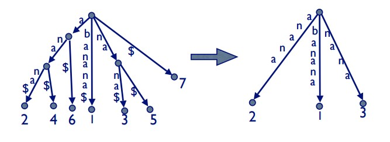

# Apuntes del enunciado

Como era de esperarse, el enunciado está bien enredado. Acá iré colocando las notas de lo que voy entendiendo.  

Primero recordemos lo que es un suffix tree. Es un árbol que tiene todos los sufijos posibles de la palabra donde cada arco indica un caracter y al final -en la hoja- se encuentra un valor que indica la posición en que ese substring se encuentra dentro del string.  

Una imagen de un suffix tree de la palabra *banana* es:

### Suffix Trees implícitos

Son como los suffix trees pero donde se :
* Elimina los arcos con el símbolo $.  
* Se eliminan los nodos que no tienen al menos dos hijos.

En el ejemplo de banana, según yo se debería eliminar el primer nodo a la izquierda de la raíz, pues se quedaría sólo con un hijo. 
 
A continuación se muestra una imágen de la conversión de suffix tree a sufix tree implícito:

No he leído [este pdf](http://web.stanford.edu/~mjkay/gusfield.pdf) pero al parecer tiene todo, como se construyen los suffix trees en tiempo lineal y ejemplos de suffix trees y los implícitos.  
En caso de quedarse atascado se puede acudir a ese pdf.  

Algo importante a notar, cito:
> The implicit suffix tree for any string S will have fewer leaves than the suffix tree for
string S$ if and only if at least one of the suffixes of S is a prefix of another suffix.  

Notemos que:
* Todo nodo interno tiene al menos dos hijos, si tiene un solo hijo se debería eliminar ese nodo y unir los strings de los arcos que quedan unidos.  

### Suffix Links

Son como punteros dentro del árbol. En el árbol de BANANA las flechas punteadas son los links que sirven para la construcción.  

En ese caso por ejemplo el nodo ANA apunta a NA pues es un nodo que tiene su mismo string pero corrido en un caracter (no tiene la A del comienzo).  

El NA apunta al A pues solo le falta la N y obviamente el A apunta a la raíz que no tiene string pues si quitamos el primer caracter nos quedamos sin string.  

La gracia ahora es que si estamos en la extensión $i+1$, en la fase $j$ y agregamos un nodo $v$ que tiene el string $xa$ entonces en el siguiente paso tenemos que agregar el string $a$. O sea, el nodo ya existe o lo crearemos en el siguiente paso. Solo debemos recordar el nodo que creamos en el paso anterior.  

*Todos los nodos tienen un suffix link*.  

Ahora veamos cómo usar estos suffix links.  

Primero, debemos mantener un puntero a la hoja del string más largo actual, es decir a la hoja donde termina el string $S[1..i]$.  
